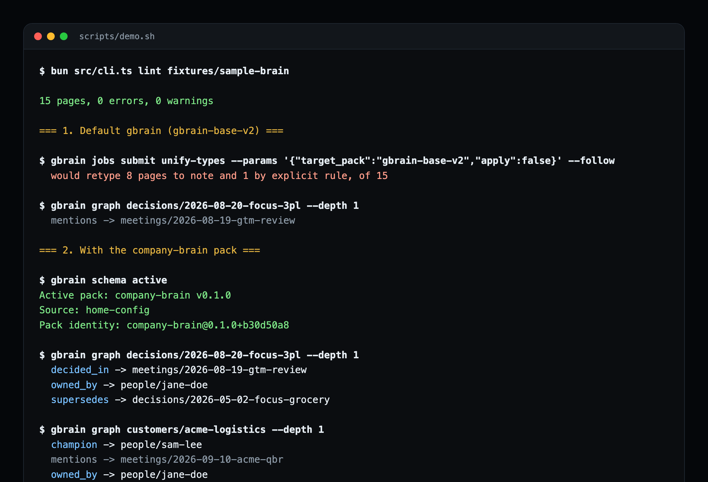

# gbrain-company-brain

A [gbrain](https://github.com/garrytan/gbrain) skillpack that loads a **company brain** into gbrain without losing its structure, then curates and queries it safely.

A company brain is a git repo of agent-readable Markdown: one file per customer, competitor, supplier, person, decision, meeting and weekly brief, plus canonical pages like `strategy.md`. The layout comes from [template-intelligence](https://github.com/agentmatik/template-intelligence), the template we run our own companies on.

[](https://github.com/mattzimak/gbrain-company-brain/actions/workflows/ci.yml) `gbrain skillpack doctor`: **10/10**. 27 unit tests, plus an end-to-end test against a real gbrain, all run in CI.



## The problem it solves

gbrain's default schema pack, `gbrain-base-v2`, is a strict 15-type taxonomy. Its catch-all rule retypes every page type it does not declare to `note`, and a second rule folds `product` into `company`.

Point a company brain at a default gbrain and run gbrain's own `unify-types` dry run on the 15-page sample brain in this repo:

```
would retype 8 pages to note and 1 by explicit rule, of 15
```

Customers, competitors, suppliers, decisions, the strategy page and the weekly brief lose their types. The relationships flatten too. A decision page gets a single generic edge:

```
$ gbrain graph decisions/2026-08-20-focus-3pl --depth 1
  mentions -> meetings/2026-08-19-gtm-review
```

## With the pack

```
$ gbrain graph decisions/2026-08-20-focus-3pl --depth 1
  decided_in -> meetings/2026-08-19-gtm-review
  owned_by -> people/jane-doe
  supersedes -> decisions/2026-05-02-focus-grocery

$ gbrain graph customers/acme-logistics --depth 1
  champion -> people/sam-lee
  mentions -> meetings/2026-09-10-acme-qbr
  owned_by -> people/jane-doe

$ gbrain graph competitors/orbit-picking --depth 1
  competes_with -> company
  owned_by -> people/priya-nair
```

All 15 pages keep their types, and with the pack active `unify-types` has no mapping rules to apply. Now an AI agent can answer "who owns this account", "is this decision still current" or "what did we agree in that meeting" from typed edges instead of guessing from text.

Both outputs above are real, from `scripts/demo.sh`.

## What is inside

| Piece | What it does |
|---|---|
| [`schema/company-brain.yaml`](schema/company-brain.yaml) | Schema pack. Extends `gbrain-base-v2` with 14 company-brain page types, `owner` / `supersedes` / `attendees` frontmatter links, phrase-based verbs (`competes_with`, `decided_in`, `champion`) and filing rules. Declares no mapping rules. |
| [`src/cli.ts lint`](src/lint.ts) | Checks a brain before sync: missing frontmatter, types the pack does not declare, pages in the wrong folder, undated decision filenames, `verified` pages without `last_verified`, wikilinks gbrain would drop, undated timeline entries. |
| [`company-brain-sync`](skills/company-brain-sync/SKILL.md) | Lint, install and activate the pack (asking first if another pack is active), add the source, sync, extract typed links, verify coverage. |
| [`company-brain-curate`](skills/company-brain-curate/SKILL.md) | Fold meeting facts into the brain. Safe, cited updates are committed; anything that changes strategy, decisions or verified pages goes to a pull request for a human. |
| [`company-brain-ask`](skills/company-brain-ask/SKILL.md) | Read-only answers from typed edges, with page citations, freshness and stated gaps. |
| [`fixtures/sample-brain`](fixtures/sample-brain) | Kestrel Robotics, a small and entirely fictional company brain used by the tests and the demo. |

## Quick start

Needs [Bun](https://bun.sh) and gbrain 0.42 or newer.

```bash
git clone https://github.com/mattzimak/gbrain-company-brain
cd gbrain-company-brain

# 1. Check your brain
bun src/cli.ts lint /path/to/your-company-brain

# 2. Install and activate the pack
mkdir -p ~/.gbrain/schema-packs/company-brain
cp schema/company-brain.yaml ~/.gbrain/schema-packs/company-brain/pack.yaml
gbrain schema validate company-brain
gbrain schema use company-brain

# 3. Sync and extract typed links (frontmatter included)
gbrain sources add acme --path /path/to/your-company-brain
gbrain sync --source acme --no-embed
gbrain extract links --source db --include-frontmatter --source-id acme

# 4. Verify
gbrain schema stats --source acme
```

Or let your AI agent walk the steps: install the skills with `gbrain skillpack scaffold mattzimak/gbrain-company-brain --workspace <your-agent-workspace>`, keep the clone above for the schema pack and lint CLI, then ask it to "connect my company brain to gbrain".

To see the before and after on the sample brain, without touching your own gbrain: `./scripts/demo.sh`.

## Tests

```bash
bun run test        # 27 unit tests: pack contract, lint rules, skills contract
bun run test:e2e    # real gbrain, throwaway PGLite brain, isolated GBRAIN_HOME
```

The e2e test runs when `gbrain` is on your PATH (or `GBRAIN_BIN` points at it) and skips otherwise. It asserts 15 of 15 pages typed and the `owned_by`, `supersedes`, `decided_in`, `competes_with`, `champion` and `attended` edges.

## Known gbrain limitations (0.50)

Found while building this. Both are worked around here, reported upstream, and reproducible from this repo: [gbrain#5142](https://github.com/garrytan/gbrain/issues/5142) and [gbrain#5143](https://github.com/garrytan/gbrain/issues/5143). A fix for the first is proposed in [gbrain#5153](https://github.com/garrytan/gbrain/pull/5153).

How the pieces fit together, and why they are shaped this way: [docs/ARCHITECTURE.md](docs/ARCHITECTURE.md).

- **`gbrain extract links --source fs` ignores the active pack's page types.** It guesses the type from a hardcoded folder table (`people`, `companies`, `deals`, `meetings`, else `concept`), so pack-declared frontmatter links never fire on that path. Use `--source db`.
- **Page-type link inference ignores `target_type`.** A verb bound to a page type labels every link out of that page, so `decided_in` and `competes_with` use phrase regexes instead. For the same reason, gbrain's built-in rule labels every link out of a meeting page `attended`, even one pointing at a decision.

## Related

- [template-intelligence](https://github.com/agentmatik/template-intelligence): the brain layout this pack targets, curation contract included.
- [brain-curation-loop](https://github.com/agentmatik/brain-curation-loop): how such a brain gets written in the first place: an n8n extract tap, a nightly curator agent, and PR approval in Slack for sensitive changes.

## License

MIT. The sample brain is fictional; any resemblance to real companies or people is a coincidence.
